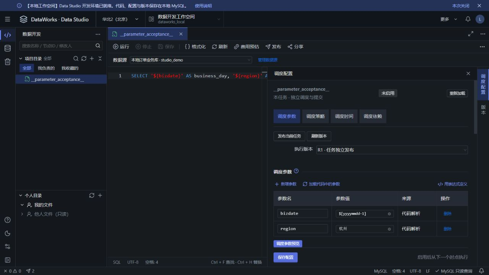
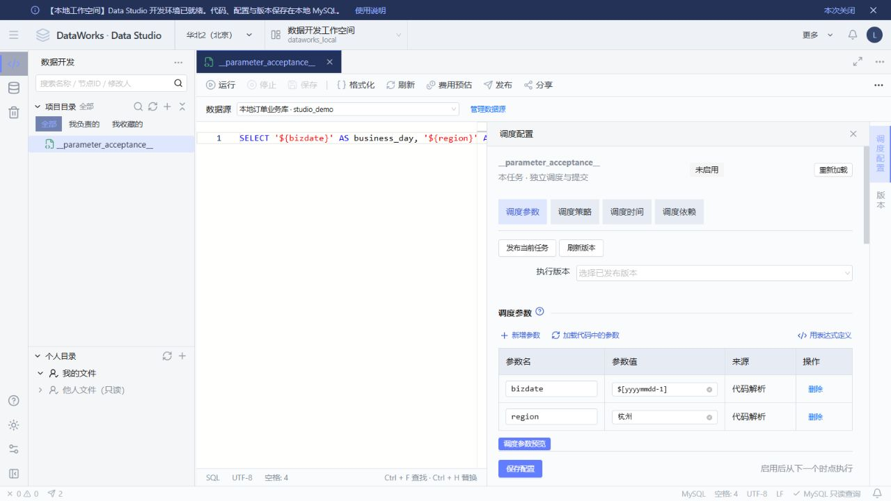
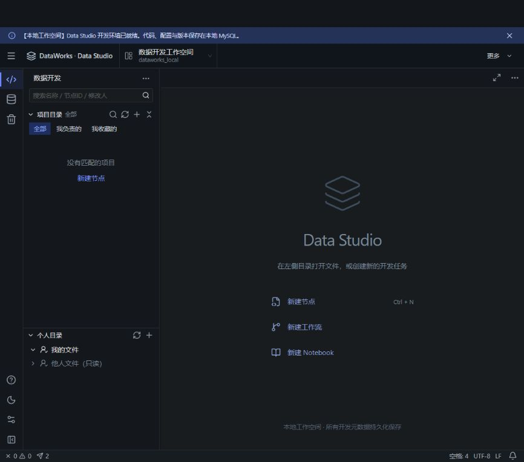

# SinketDataWorks

参考阿里云 DataWorks / Data Studio 交互的本地数据开发工作台，面向单用户开发与演示。使用 React、Monaco Editor 和 React Flow 提供代码与工作流编辑，通过 Spring Boot 和 MySQL 持久化开发文件、版本、发布快照、调度及运行结果。

## 功能

- **数据开发**：项目与个人目录、SQL / Notebook / 工作流编辑、多标签、草稿保护、版本对比与恢复。
- **真实 MySQL 执行**：查询、增删改、多语句 SQL、表结构操作、结果分页及取消。
- **发布与调度**：任务和工作流的不可变发布版本、业务日期参数、Cron、上游依赖与运行历史。
- **离线同步**：通过 Dunnelean Java SDK 控制独立 Rust 服务，实现 MySQL ↔ Doris 批量传输，支持追加、主键更新、清空后覆盖。
- **数据源与回收站**：连接测试、真实表与字段浏览、密码加密保存、目录与文件恢复。

MySQL 与离线同步节点执行真实业务操作；其他引擎、Python、Shell 和 Notebook 运行仍使用本地模拟。

## 界面预览

以下是 2026-09-29 的历史功能示例，截图保留当时的 Data Studio 名称，当前界面已统一为 SinketDataWorks。



<details>
<summary>浅色主题与空工作台</summary>





</details>

## 技术栈与环境

| 部分 | 技术 / 要求 |
| --- | --- |
| 前端 | Node.js 24、React 19、TypeScript 5.9、Vite 7、Ant Design 6、Monaco Editor、React Flow |
| 后端 | JDK 25、Maven 3.9+、Spring Boot 4.1.1、Spring JDBC、Flyway |
| 元数据库 | MySQL，已验证环境为 9.7.2，字符集 `utf8mb4` |
| 可选离线同步 | Dunnelean Java SDK 0.1.0、独立 Dunnelean Rust 服务、MySQL 与 Doris |
| 辅助脚本 | PowerShell；同步验收另外需要 Python 和 `pymysql`、`requests`、`psutil` |

基础工作台需要 MySQL、后端及前端。后端构建始终需要先安装 Dunnelean Java SDK；仅使用基础工作台时无需启动 Rust 服务或 Doris。Docker 仅用于容器数据库及相关辅助脚本。以下命令以 Windows PowerShell 为例，`java`、`mvn.cmd`、`node`、`npm.cmd`、`git` 应在 PATH 中。

## 启动

### 1. 克隆项目与安装 SDK

```powershell
git clone https://github.com/casperfrome/SinketDataWorks.git
Set-Location SinketDataWorks

# SDK 尚未发布到 Maven Central，安装到本机 Maven 仓库。
# 在相邻目录使用独立 checkout，避免修改已有的 Dunnelean 开发目录。
git clone https://github.com/casperfrome/Dunnelean.git ../Dunnelean
git -C ../Dunnelean checkout --detach 7053dc9da70aa0d5f9874017ce2162a7f010522d
mvn.cmd -B -ntp -f ../Dunnelean/sdk/java/pom.xml install
```

已有对应版本的 SDK 时可跳过安装。详细依赖及同步服务配置见[离线批量同步](docs/offline-sync.md#java-sdk-依赖)。

### 2. 准备数据库与本地配置

默认元数据库为 `127.0.0.1:3306/fake_dataworks_260927`。先准备自己的 MySQL 实例，创建数据库：

```sql
CREATE DATABASE IF NOT EXISTS fake_dataworks_260927
  CHARACTER SET utf8mb4 COLLATE utf8mb4_0900_ai_ci;
```

仅首次配置时，在项目根目录复制模板，编辑数据库地址、账号、密码和加密密钥；已有本地配置时保留原文件：

```powershell
Copy-Item backend/application-local.properties.example backend/application-local.properties

# 生成随机 32 字节密钥，将输出填入 studio.datasource.encryption-key。
$keyBytes = New-Object byte[] 32
$keyGenerator = [Security.Cryptography.RandomNumberGenerator]::Create()
try { $keyGenerator.GetBytes($keyBytes) } finally { $keyGenerator.Dispose() }
[Convert]::ToBase64String($keyBytes)
```

本地配置被 Git 忽略。加密密钥应固定保存；恢复含数据源的数据库时必须使用原密钥。也可不创建本地文件，改用 `DB_URL`、`DB_USER`、`DB_PASSWORD`、`STUDIO_ENCRYPTION_KEY` 环境变量；本地文件显式配置的同名属性优先。

使用 Docker MySQL 时，可用初始化脚本代替手动执行上面的 SQL。将示例容器名替换为自己的容器名称或 ID：

```powershell
$env:MYSQL_CONTAINER = 'your-mysql-container'
powershell.exe -NoProfile -ExecutionPolicy Bypass -File ./scripts/init-db.ps1
# 也可通过 -ContainerId 显式选择容器。
```

脚本读取 `DB_PASSWORD`，未提供时读取本地配置，只创建默认元数据库。后端首次启动通过 Flyway 建表，仅初始化一个「数据开发工作空间」，开发目录和数据源为空。其他空间由用户在顶部空间选择器旁的「工作空间管理」中创建：填写唯一的工作空间名称和显示名，再进入该空间添加文件、数据源。每个空间独立管理开发对象、运行记录和发布版本。

旧版本数据库升级前需备份；V6 会将已有开发对象移入回收站并暂停计划，参见[参数与迁移说明](docs/schedule-parameters.md)。V8 将旧内置沙箱与同步验收空间退出用户列表并暂停其自动计划，保留原有文件、连接与历史记录，用户自建空间保持可见。空间管理流程参考 [DataWorks 创建工作空间](https://help.aliyun.com/zh/dataworks/user-guide/create-a-workspace)；当前实现使用本地环境。

### 3. 启动后端与前端

在项目根目录打开两个 PowerShell 终端。终端一：

```powershell
Set-Location backend
mvn.cmd spring-boot:run
```

终端二：

```powershell
Set-Location frontend
npm.cmd ci
npm.cmd run dev -- --port 5173 --strictPort
```

访问 [http://127.0.0.1:5173](http://127.0.0.1:5173)。后端默认地址为 `http://127.0.0.1:8080`，健康检查为 `/actuator/health`。Vite 将 `/api` 和 `/actuator` 代理到后端。

日志直接显示在终端，按 `Ctrl+C` 停止对应进程。前端支持热更新；后端源码修改后需重启。端口占用时确认已有服务，前端可通过 `--port` 调整；后端改用 `SERVER_PORT` 时需同步调整 Vite 代理。生产构建输出在 `frontend/dist`，开发服务不用于公网部署。

## 使用

1. 在“数据源”添加业务 MySQL 连接，测试连接并浏览表与字段。
2. 在“数据开发”新建 MySQL 节点，选择数据源，编写 SQL 并保存。
3. 在右侧配置调度参数，预览业务日期后运行；发布任务并应用到调度后，可启用计划。
4. 新建工作流，添加任务与依赖，查看各节点结果；通过版本面板或回收站恢复内容。

常用快捷键：`Ctrl+S` 保存、`F8` 运行、`F9` 停止、`Shift+Alt+F` 格式化。未保存草稿仅保留在当前前端会话中，刷新或关闭浏览器前应先保存。

## 开发与检查

前端在 `frontend` 目录运行：

```powershell
npm.cmd ci
npm.cmd run typecheck
npm.cmd test
npm.cmd run build
```

后端在 `backend` 目录运行，以下单元检查及打包不连接数据库：

```powershell
mvn.cmd -B -ntp "-Dtest=*Test,!*IntegrationTest" test
mvn.cmd -B -ntp -DskipTests package
```

完整 `mvn.cmd test` 包含真实 MySQL 集成测试，应通过 `-Dspring.datasource.url` 使用独立测试元数据库，并准备所需业务连接。库存集成测试需额外提供 `INVENTORY_TEST_ROOT_PASSWORD`；详见[库存测试说明](docs/inventory-scheduling.md#接口与测试)。同步故障验收会操作独立测试库和专用后端进程，准备步骤见[离线同步验证](docs/offline-sync.md#验证)。

PowerShell 文件读取请显式使用 UTF-8。Python 辅助脚本应在已安装上述依赖的专用环境运行。

## 项目结构与文档

```text
frontend/          React 工作台、编辑器、状态管理及规则测试
backend/           Spring Boot 后端、Flyway 迁移及单元 / 集成测试
scripts/           数据库初始化、备份、演示 SQL 及验证脚本
docs/              架构、功能说明及精选历史截图
.runtime/          本地报告、备份、日志及归档（忽略）
backend/storage/   默认上传资源目录（忽略）
```

- [系统架构](docs/architecture.md) · [后端接口](backend/README.md)
- [MySQL 查询与写入](docs/mysql-query.md) · [工作流执行与发布](docs/workflow-execution.md)
- [调度参数](docs/schedule-parameters.md) · [任务调度](docs/task-scheduling.md) · [库存日结与调度](docs/inventory-scheduling.md)
- [MySQL ↔ Doris 离线同步](docs/offline-sync.md)

## 运行与数据边界

本项目面向本机单用户使用，没有账号认证、多人权限或分布式调度。服务默认监听回环地址。

普通 SQL 按语句提交，停止或失败不会撤销已提交语句。离线同步按批次写入，清空后覆盖会执行 TRUNCATE，失败可能留下部分目标数据；具体恢复规则见同步文档。

备份需要同时保存元数据库、原加密密钥、上传资源；使用离线同步时另需保留 Dunnelean 状态库。可运行 `scripts/backup-metadata.ps1 -ContainerId 'your-mysql-container'` 备份默认元数据库到 `.runtime/backups`。仓库只包含代码和示例，不包含本机数据库、密码、上传文件或历史验收快照。
