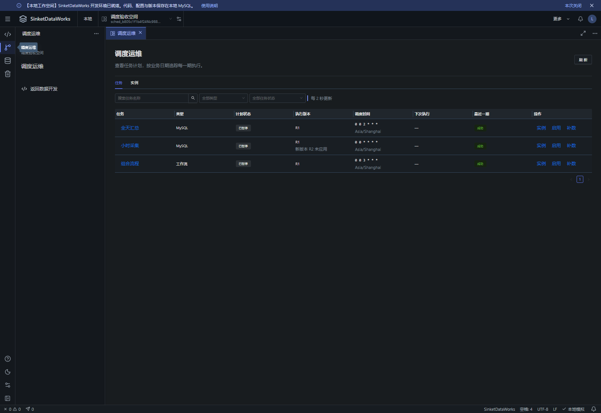
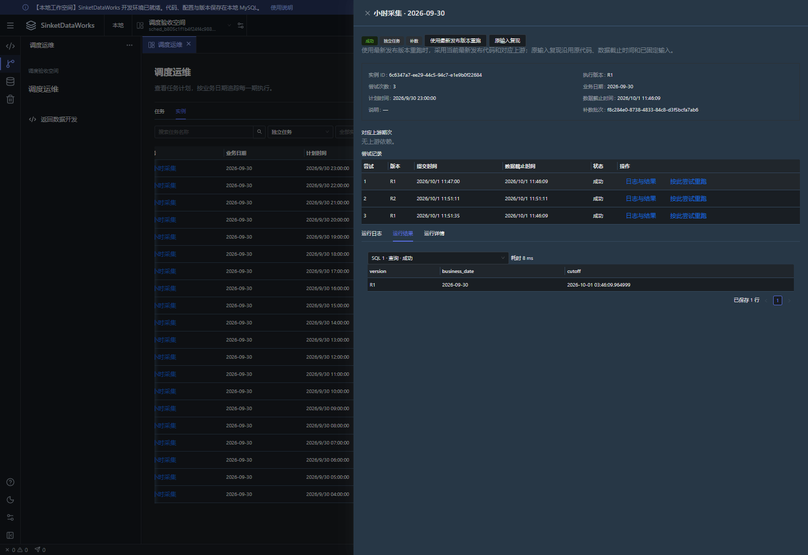
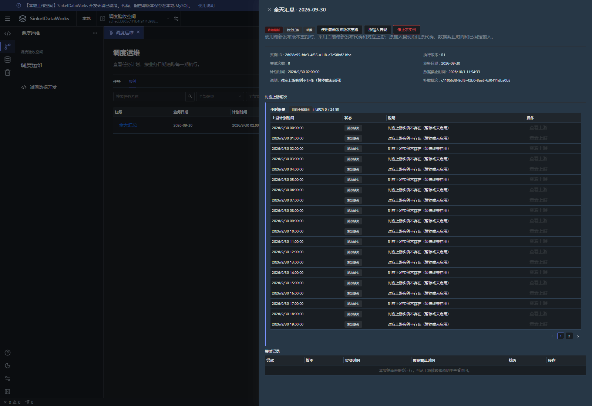

# 轻量调度验收记录

验收日期：2026-10-01。调度模型及接口见 [任务调度](task-scheduling.md)。

## 环境与结果

后端使用独立 MySQL 元数据库，业务验收使用随机创建的 MySQL 业务库及工作空间；未使用项目正式元数据库执行迁移或写入验收数据。浏览器另用独立元数据库，后端端口 18080、前端预览端口 15173。测试与浏览器结束后清理自身数据库、账号及进程。

- 后端先执行全量 `mvn.cmd -B -ntp test`，修复后执行 `TaskInstanceSchedulerTest,SqlRetryTest,SchedulingOperationsIntegrationTest` 定向复测，并为 `NodeDebugIntegrationTest` 补充独立 Doris 只读库及账号。最终各测试套件报告合计 234 项：全部通过，0 失败、0 错误、0 跳过。
- 前端 `npm.cmd run typecheck`、`npm.cmd test` 和最终生产构建通过，51 项测试通过。浏览器使用生产构建及真实隔离后端。
- V10 的空库迁移及旧元数据库升级路径通过迁移集成测试；旧实例、ID、发布包和运行记录保留。

## 场景覆盖

| 场景 | 验收证据 |
|---|---|
| 停机逐期漏跑、超过 200 条跨轮继续、正常迟到排队、重复扫描去重 | `TaskInstanceSchedulerTest`、`InventoryIntegrationTest` |
| 执行资格与资源等待、跨调试/独立任务/工作流入口互斥 | `ExecutionConsistencyTest`、`TaskInstanceSchedulerTest`、库存与工作流集成测试 |
| ALL_DAY 未来、缺失、失败阻断，修复后放行；批量查询与夏令时 | `TaskInstanceSchedulerTest`、`SchedulingOperationsIntegrationTest`；秋季 25 小时及 1,500 分钟期次 |
| 最新 R 刷新参数/截止时间/成功上游及依赖映射，ORIGINAL 恢复所选历史输入与依赖图 | 调度核心及统一接口集成测试；浏览器 R1 → R2 → R1 三次真实 SQL 查询 |
| 补数批次隔离、依赖闭包、5,000 上限、预览版本检查、请求幂等 | `SchedulingOperationsIntegrationTest`；同 requestId 跨空间并发只允许一个批次 |
| 暂停撤回未开始尝试、保留原上下文、暂停期间显式补数 | `TaskInstanceSchedulerTest`、`SyncControlTest`、`SimulationRecoveryTest`；浏览器暂停任务补数 |
| 固定工作流连接、SQL 与别名；普通 DAG 并行；取消等待及提交不确定保留 | `ExecutionConsistencyTest`、`WorkflowIntegrationTest` |
| 旧工作流、库存原子提交、同步目标锁、参数绑定与草稿保护 | 后端全量回归、前端 51 项测试及浏览器任务/工作流草稿验证 |

## 浏览器完整流程

1. 从「调度运维」任务页查看两项独立任务、一项组合工作流；显示生效 R、Cron、时区、暂停状态及最近实例。启用后显示下一计划时间，再暂停成功。
2. 查看停机漏跑实例：没有 runId 仍可查看日期、原因、固定上下文和空尝试历史；实际尝试次数为 0。
3. 在暂停的小时根任务上预览整日补数，勾选受影响下游：共 24 个小时实例及 1 个 ALL_DAY 汇总实例。预览可展开参数和全部依赖。
4. 提交后自动进入本批实例列表。小时实例按执行资格排队；全天汇总等待 24/24 成功后执行，25 个实例全部成功且共用一个固定截止时间。
5. 新发布 R2，保持任务生效计划为 R1。通过「使用最新发布版本重跑」得到 R2 参数及新的截止时间；按历史 R1 尝试重跑恢复 R1 参数及原截止时间。同一实例完整保留三次成功尝试和 SQL 结果。
6. 单独补数下游，因缺少周期上游而阻断，未使用其他补数批次的成功结果。详情显示全部缺失期次及 0 次尝试；「停止本实例」最终确认 CANCELLED，没有创建运行。
7. 组合工作流通过同一补数预览与实例列表整体执行成功，其内部节点继续由原协调器执行。
8. 任务、工作流分别修改调度草稿，切换到运维再返回仍保留。重新加载不会吞掉未保存草稿；关闭标签触发保存/丢弃/取消保护。

## 部署边界

仍为本地单用户、单 Spring Boot 进程、一个扫描时钟和已有执行池。实例及尝试复用原触发表与 `dw_run`；没有引入消息队列、分布式协调器或独立补数引擎。只实现 LATEST 与 ALL_DAY，ALL_DAY 仅作为完成屏障。

补数预览凭证在当前进程签发，24 小时有效；服务重启后重新预览。已经提交的批次及请求摘要持久化，重启后重复请求仍返回同一批。
